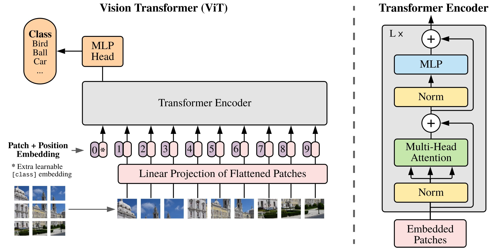
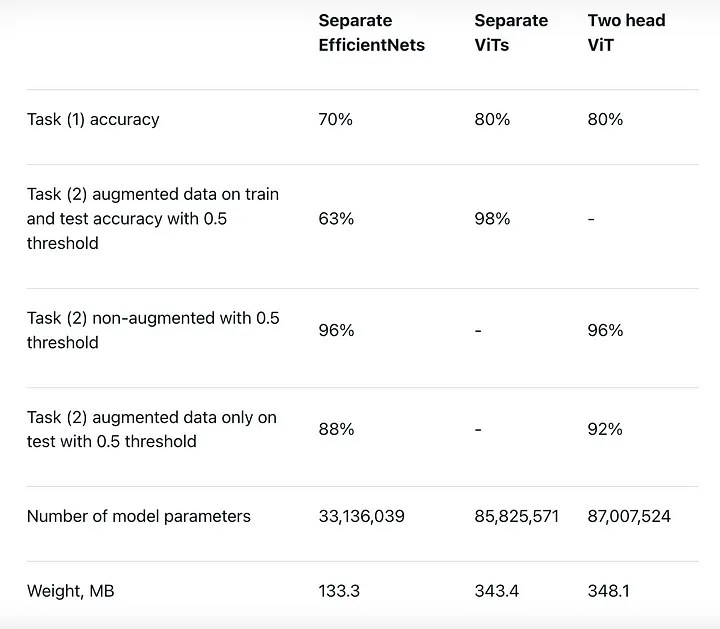

# Military aircraft classification with deep learning
## Introdution
In the realm of modern defense, accurate and efficient identification of military aircraft is critical for strategic planning, threat assessment, and operational decision-making. Recognizing the need for an advanced solution to address the complexities of aircraft classification, I have developed a novel tool designed to for identifying military aircraft.

This tool utilizes one of State Of the Art Architectures (SOTA)  in image recognition to automatically classify a wide range of military aircraft based on key visual and aerodynamic features. By leveraging large datasets of aircraft images and technical specifications, the tool is capable of distinguishing between different aircraft models with high precision, even in complex operational environments.

The tool is designed to be adaptable, scalable, and capable of integrating with existing defense systems, offering a valuable asset for military personnel and analysts. Whether used in real-time surveillance, intelligence gathering, or strategic planning, this tool provides a critical advantage in understanding and responding to airborne threats.

The development of  aircraft classification tools like this represents a significant advancement in defense technology, offering enhanced operational capabilities and contributing to the ongoing effort to maintain air superiority and security.

## Objective
The primary objective of this work is to develop an advanced tool that leverages modern deep learning architectures to classify different types of military aircraft. By utilizing state-of-the-art neural networks, this tool aims to automate the process of identifying and categorizing various aircraft based on distinctive visual features. These features include shape, size, aerodynamic structure, and other unique design characteristics that differentiate one aircraft model from another.
## Design
### Neural network architecture

The Vision Transformer (ViT) is a deep learning model introduced in 2020 for image classification tasks. Unlike traditional Convolutional Neural Networks (CNNs) that operate on local receptive fields, ViT leverages the transformer architecture, which was originally designed for natural language processing (NLP) tasks, such as machine translation. By applying transformers to image data, ViT introduced a novel approach to visual recognition tasks that has since demonstrated competitive performance compared to CNNs, especially on large datasets. 

Below you can see comparsion of Vit with EfficientNet on image classfication task. [Place365](http://places2.csail.mit.edu/download.html) and  [Houses](https://github.com/emanhamed/Houses-dataset) datasets were used in this comparsion.

### Dataset

In this work I used  [this](https://www.kaggle.com/datasets/a2015003713/militaryaircraftdetectiondataset) dataset. This dataset is designed for object detection of military aircraft. The dataset encompasses 74 different military aircraft types, with some types merged as one class along with their variants.

A-10, A-400M, AG-600, AH-64, AV-8B, An-124, An-22, An-225, An-72, B-1, B-2, B-21, B-52, Be-200, C-130, C-17, C-2, C-390, C-5, CH-47, CL-415, E-2, E-7, EF-2000, F-117, F-14, F-15, F-16, F-22, F-35, F-4, F/A-18, H-6, J-10, J-20, JAS-39, JF-17, JH-7, KC-135, KF-21, KJ-600, Ka-27, Ka-52, MQ-9, Mi-24, Mi-26, Mi-28, Mig-29, Mig-31, Mirage2000, P-3, RQ-4, Rafale, SR-71, Su-24, Su-25, Su-34, Su-57, TB-001, TB-2, Tornado, Tu-160, Tu-22M, Tu-95, U-2, UH-60, US-2, V-22, Vulcan, WZ-7, XB-70, Y-20, YF-23, Z-19.

